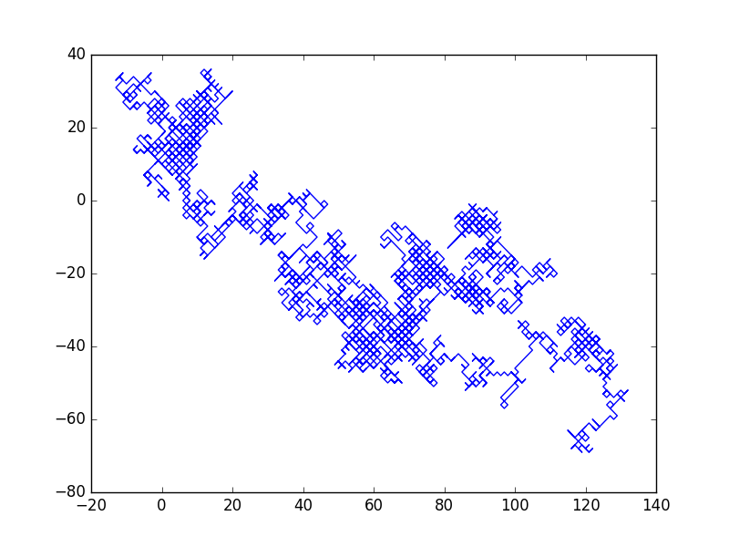
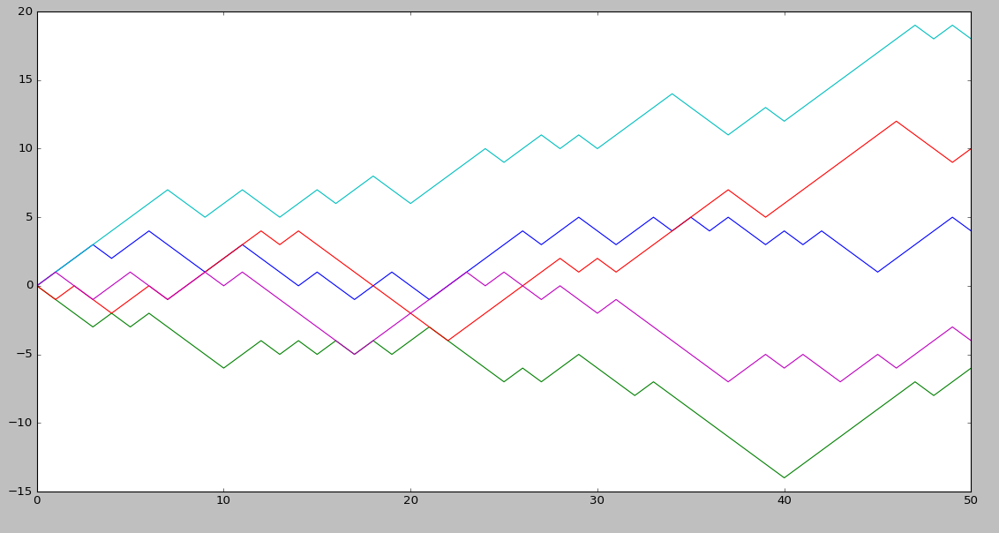
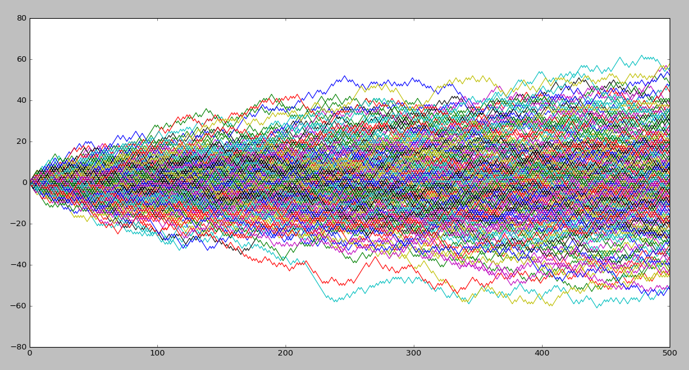
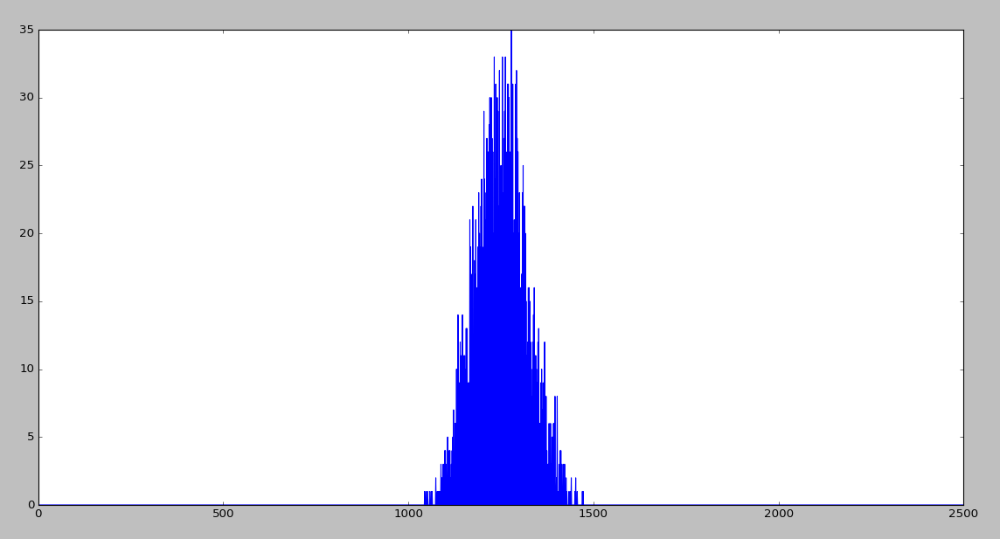

# Random_walk_1D
These are basic codes to visualize the diffusion of particles
Simulation of diffusion in one dimension

The step size is taken constant and equal to one.
The code also show how the particles deviate from the center

and also shows how the distribution converges to gaussian as number of particles are increased.

approaching the gaussian as n increases

